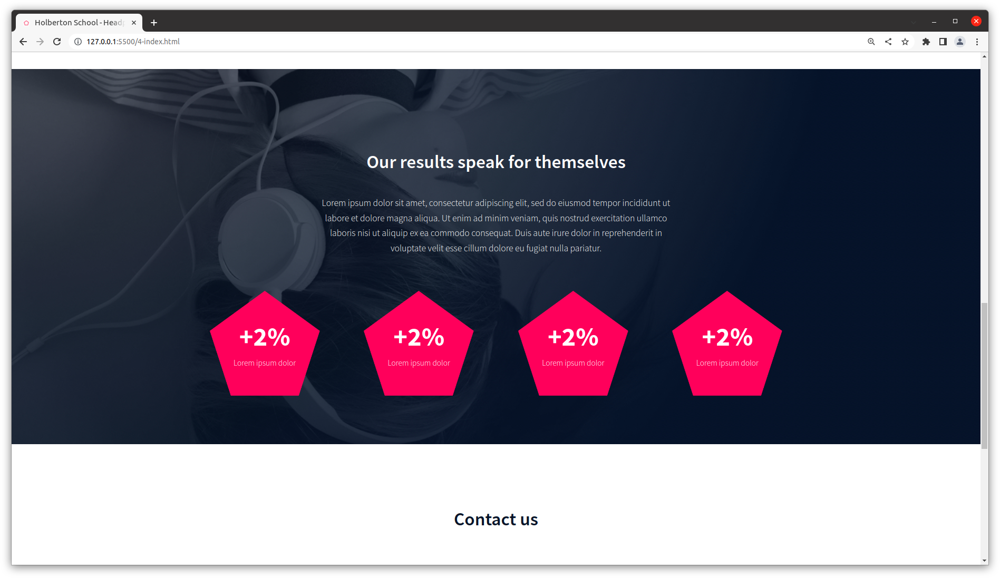
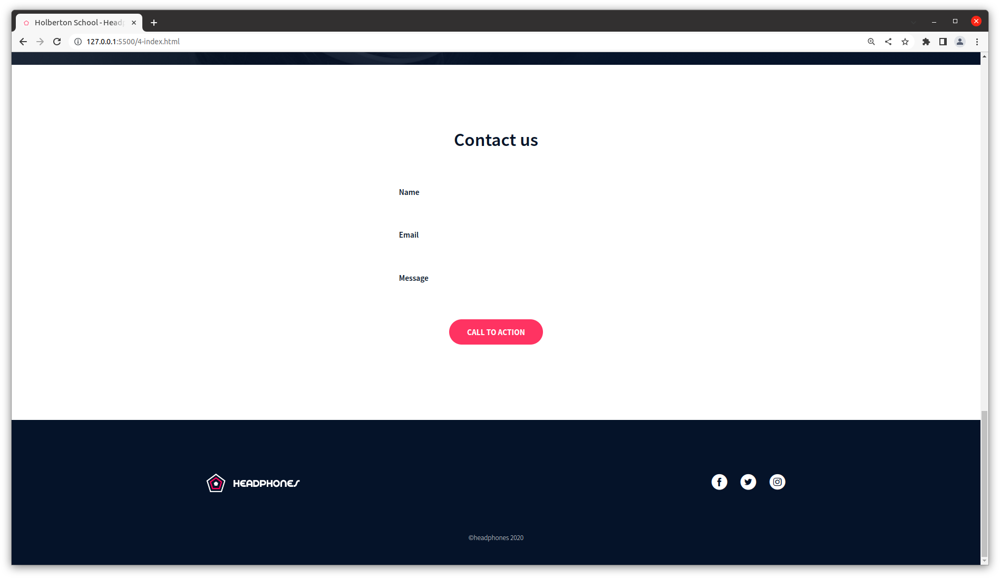
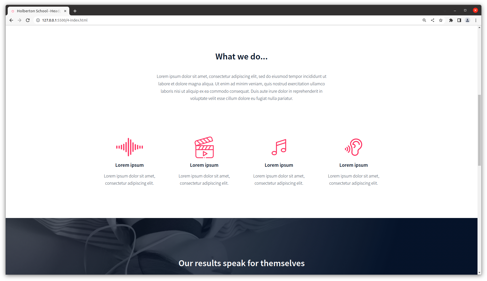
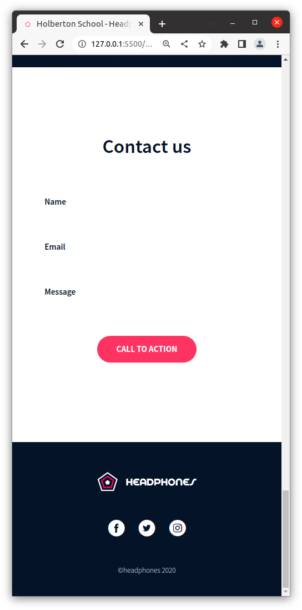

# Headphones Website
Implementing a responsive web design from scratch from a [Figma file](https://www.figma.com/file/FfnVADRC9xgI3yiZliTBYZ/Holberton-School---Headphone-company?type=design&node-id=0%3A487&mode=dev), as a project assigned by Holberton. For this project, no files were provided.

The goal of this project is to put the skills we learned in the first month of the Full-Stack Web Development Specialization to work here. We've been learning about HTML+CSS, responsive design, forms, and how to make a hamburger button.

The webpage is HTML and CSS only and front-end only.
## Webpage Screenshots
### Banner Section

### Results Section

### "Contact Us" Section & Footer

### "What We Do" Section

### "Contact Us" Section & Footer, in Mobile

## Features
- Hamburger button on mobile
- Responsive breakpoints for rows & columns of dots
- Responsive background images
### Features that Still Need Implementing
- Have the hamburger respond consistently
- Have the header, header items and banner background align correctly
- Have the items in the Results and What We Do sections fit correctly inside the screen
## Files
Each file that starts with a number is part of that exercise, and each exercise adds the next section of the page.
## Check it out!
It's also a GitHub webpage!
## About me
I'm Gabriel Fernandez, the developer of this project, and I started studying at Holberton in Sep. 2022, and have chosen Web Development as my Holberton specialization. This project is part of that specialization.
### My Contacts

## Building this project
I spent a week in my grandparents' house building this webpage. I had a hard time concentrating, but still chose to persevere. I had (and still have) lots of trouble with the banner and header, so I skipped ahead to the next exercises, and found myself constantly having to go back and re-do the older ones to make them match. Eventually, I managed to make the webpage function somewhat decently.

The most difficult challenges were:
- Making the website look as exactly as the Figma file as possible
- Trying to simplify the CSS
- Trying to do things exactly like the instructions
- Trying to understand the instructions
- having things align
- working in an unusual environment
## Feedback
All feedback is welcome!
